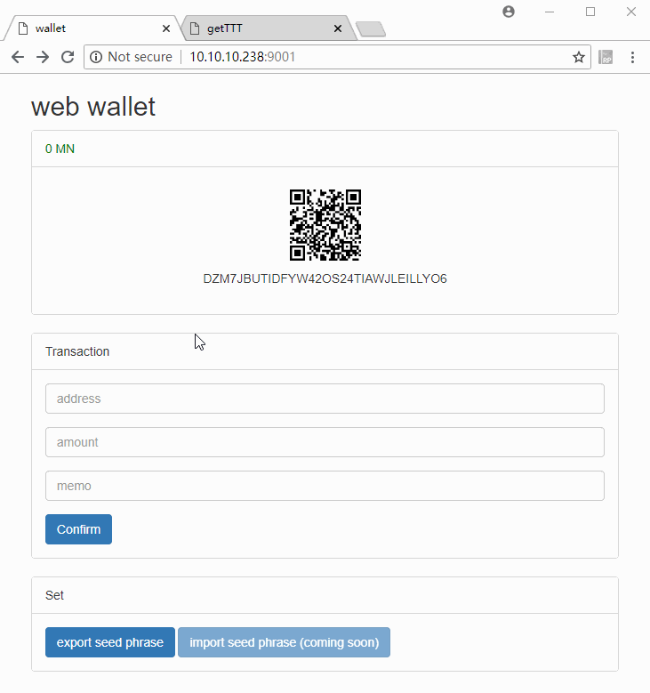
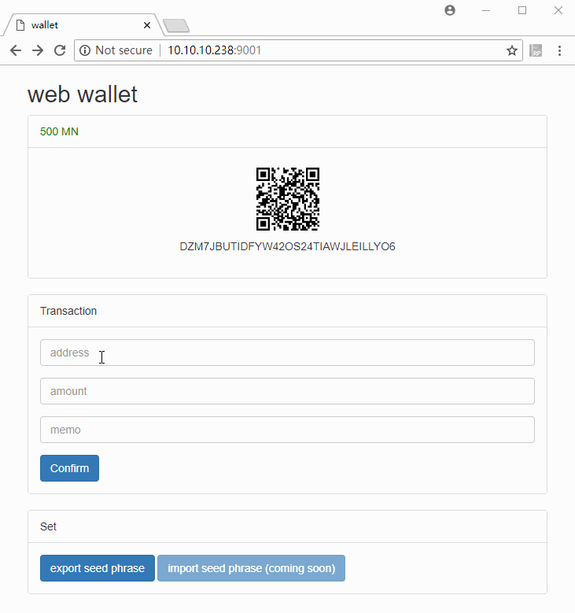

# A Web Wallet

## Install

```
git clone https://github.com/TrustNoteSamples/web_wallet.git

cd web_wallet

pip3 install -r requirements.txt
```

## Run

```
python3 web.py -p 9001
```

Now, you can visit http://localhost:9001 from your web browser and see how it works!


## Demo

* get TTT for testing



* transaction


